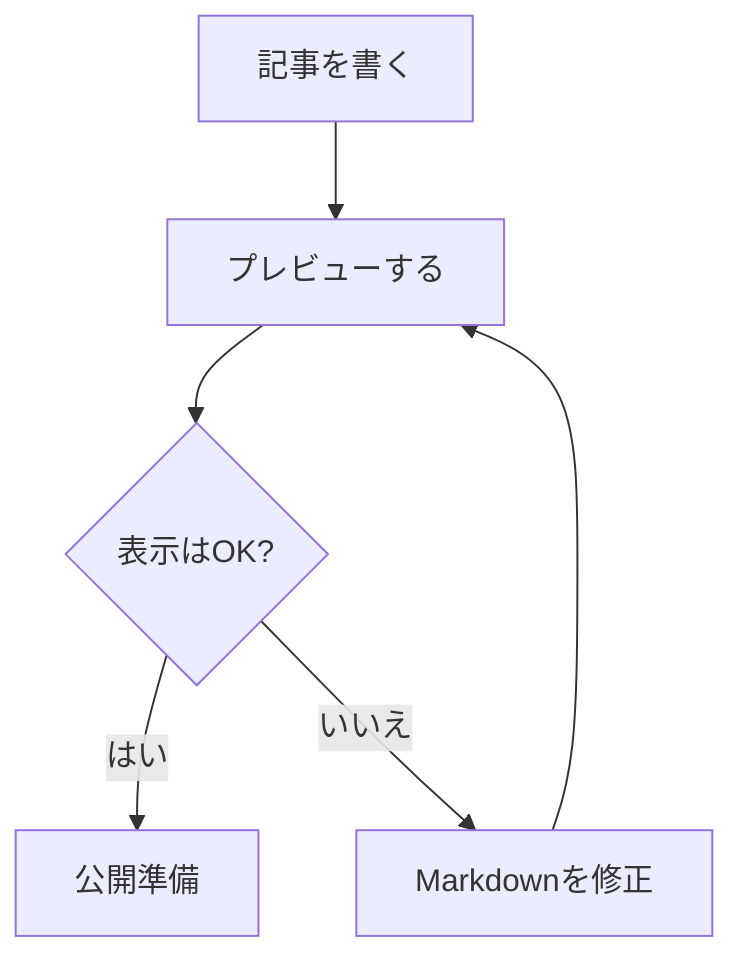
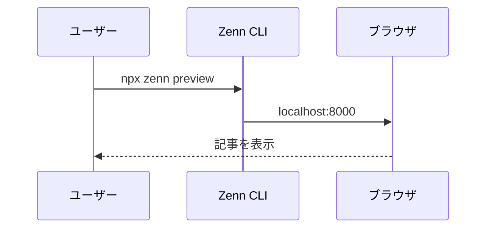

Zenn の Markdown 表示をまとめて確認するためのテスト記事です。

外部サービスの埋め込みは、ネットワーク環境や提供元の仕様変更で表示が変わることがあります。

<!-- この行は HTML コメントのテストです。プレビューには表示されません。 -->

---

## 見出し

### H3 の見出し

#### H4 の見出し

見出しは目次にも反映されます。

## 段落と改行

これは通常の段落です。空行を入れると次の段落になります。

これは次の段落です。
この行は Markdown 上では改行していても、表示では同じ段落になります。

この行末にはスペースを2つ入れています。  
そのため、ここは明示的に改行されます。

## 文字装飾

**太字**、*斜体*、~~打ち消し線~~、`インラインコード` のテストです。

**太字の中に `コード` を入れる**こともできます。

Markdown 記号をそのまま表示したいときは、\*このようにエスケープ\*します。

## 絵文字

Zenn でも一般的な絵文字を使えます。📝 🚀 ✅ 💡 ⚠️

## リスト

- 箇条書き 1
- 箇条書き 2
  - ネストした箇条書き 2-1
  - ネストした箇条書き 2-2
- 箇条書き 3

1. 番号付きリスト 1
2. 番号付きリスト 2
   1. ネストした番号付きリスト 2-1
   2. ネストした番号付きリスト 2-2
3. 番号付きリスト 3

## チェックリスト

- [x] 見出し
- [x] 文字装飾
- [x] リスト
- [x] コードブロック
- [x] 表
- [ ] 公開前チェック

## 引用

> これは引用ブロックです。
> 複数行の引用も確認できます。

> 引用の中に **太字** や `コード` も書けます。
>
> - 引用内リスト
> - 引用内リスト

## 区切り線

上にも下にも水平線があります。

---

ここから下に続きます。

## リンク

通常のリンクです。

[Zenn](https://zenn.dev)

URL をそのまま書いたリンクです。

https://zenn.dev

山括弧で囲んだリンクです。

<https://zenn.dev>

## リンクカード

URL だけを1行で書くと、リンクカードとして表示されます。

https://zenn.dev/zenn/articles/markdown-guide

明示的にカード化する記法です。

@[card](https://zenn.dev/zenn/articles/markdown-guide)

## 画像

ローカルに置いた生成画像です。


*生成した画像を記事に差し込むテスト*

添付されたスクリーンショットを復元して差し込んだ例です。


*会話に添付されたスクリーンショットを記事に差し込むテスト*

通常の画像です。


画像サイズを指定した例です。


画像にリンクを付けた例です。

[](https://zenn.dev)

## 表

| 左寄せ | 中央寄せ | 右寄せ |
| :--- | :---: | ---: |
| alpha | beta | 100 |
| 日本語 | 中央 | 200 |
| `code` | **bold** | 300 |

## コードブロック

言語指定なしのコードブロックです。

```
plain text
markdown-test
```

TypeScript のコードブロックです。

```ts
const title = "マークダウンテスト";

function greet(name: string) {
  return `こんにちは、${name}さん`;
}

console.log(greet("Zenn"));
```

ファイル名付きのコードブロックです。

```ts:src/example.ts
export function add(a: number, b: number) {
  return a + b;
}
```

JSON のコードブロックです。

```json
{
  "title": "マークダウンテスト",
  "published": false,
  "topics": ["markdown", "zenn", "test"]
}
```

diff のコードブロックです。

```diff
- const published = true;
+ const published = false;
```

シェルコマンドのコードブロックです。

```bash
npx zenn new:article
npx zenn preview
```

## 数式

インライン数式です。$a^2 + b^2 = c^2$

ブロック数式です。

$$
\sum_{i=1}^{n} i = \frac{n(n+1)}{2}
$$

## 脚注

本文中に脚注を置けます。これは脚注のテストです。[^note]

別の脚注も置けます。[^another-note]

[^note]: これは脚注の本文です。
[^another-note]: もう1つの脚注です。リンクや `コード` も書けます。

## メッセージ

:::message
これは通常のメッセージです。補足情報や注意書きに使えます。
:::

:::message alert
これは alert のメッセージです。強めの注意に使えます。
:::

## アコーディオン

:::details クリックすると開きます
中に Markdown を書けます。

- リスト
- **太字**
- `インラインコード`

```txt
details の中のコードブロック
```
:::

## Mermaid

フローチャートです。



シーケンス図です。



## 外部埋め込み

YouTube の埋め込みです。

@[youtube](https://www.youtube.com/watch?v=dQw4w9WgXcQ)

X の投稿 URL です。

https://x.com/jack/status/20

GitHub のファイル URL です。

https://github.com/zenn-dev/zenn-editor/blob/canary/packages/zenn-cli/README.md

GitHub Gist の埋め込みです。

@[gist](https://gist.github.com/mbostock/4062045)

CodePen の埋め込みです。

@[codepen](https://codepen.io/team/codepen/pen/PNaGbb)

JSFiddle の埋め込みです。

@[jsfiddle](https://jsfiddle.net/zalun/NmudS/)

Speaker Deck の埋め込みです。

@[speakerdeck](https://speakerdeck.com/yusukebe/hono)

SlideShare の埋め込みです。

@[slideshare](https://www.slideshare.net/slideshow/embed_code/key/8m2xJzJjJb5z4w)

CodeSandbox の埋め込みです。

@[codesandbox](https://codesandbox.io/s/new)

StackBlitz の埋め込みです。

@[stackblitz](https://stackblitz.com/edit/vitejs-vite-8vywsb)

Figma の埋め込みです。

@[figma](https://www.figma.com/file/fn6TAjD3W0hXcBJ6rQ2ZLt/Figma-basics)

## まとめ

このページでは、Zenn でよく使う Markdown と独自記法をまとめて確認できます。
